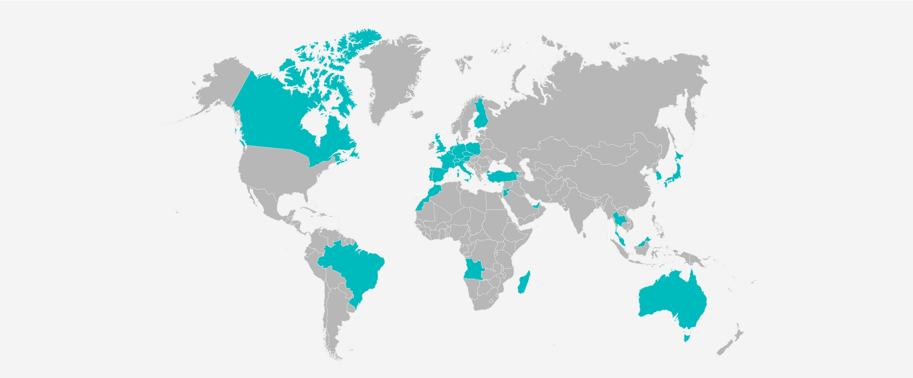
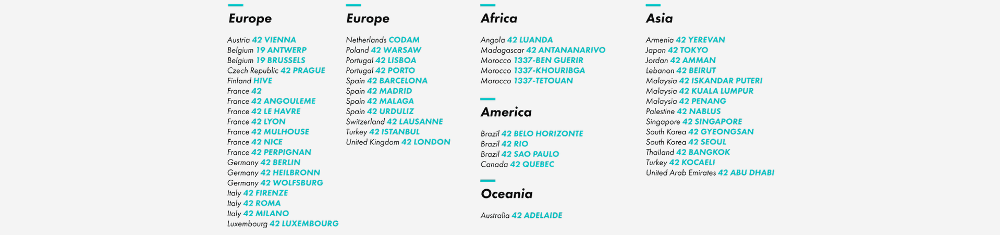
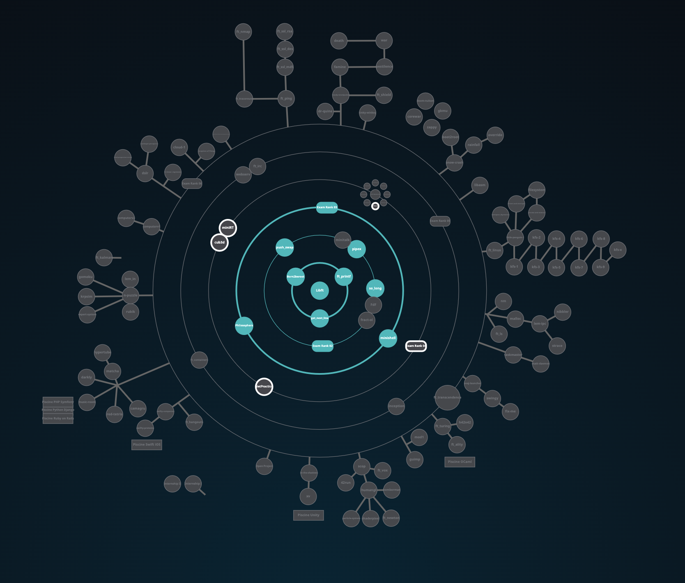

#  🗣 &nbsp;About &nbsp;42 &nbsp;cursus

 

✅ 42&nbsp; is&nbsp; completely&nbsp; free,&nbsp; with&nbsp; no &nbsp;monthly &nbsp;or &nbsp;annual &nbsp;fees. &nbsp;Our &nbsp;mission &nbsp;is &nbsp;to&nbsp; ensure&nbsp; that&nbsp; everyone &nbsp;should &nbsp;have &nbsp;access &nbsp;to&nbsp; education, &nbsp;no&nbsp; matter&nbsp; their &nbsp;financial&nbsp; situation.  
✅ Anyone &nbsp;over&nbsp; the &nbsp;age&nbsp; of&nbsp; 18&nbsp; can &nbsp;study &nbsp;at&nbsp; 42, &nbsp;with &nbsp;no&nbsp; previous&nbsp; knowledge&nbsp; in&nbsp; the &nbsp;field &nbsp;or&nbsp; any&nbsp; other &nbsp;prerequisites&nbsp; necessary.&nbsp; Upon &nbsp;application, &nbsp;students &nbsp;are&nbsp; given&nbsp; a &nbsp;logic-based &nbsp;test. &nbsp;If &nbsp;successful, &nbsp;students &nbsp;can &nbsp;move&nbsp; to &nbsp;the&nbsp; next&nbsp; step.  
✅ With&nbsp; 42’s &nbsp;revolutionary &nbsp;educational&nbsp; program, &nbsp;students &nbsp;work &nbsp;on &nbsp;projects &nbsp;that&nbsp; interest &nbsp;them &nbsp;in &nbsp;close&nbsp; collaboration&nbsp; with&nbsp; their&nbsp; peers.&nbsp; The&nbsp; center &nbsp;is &nbsp;open &nbsp;7&nbsp; days&nbsp; a &nbsp;week,&nbsp; 24 &nbsp;hours&nbsp; a&nbsp; day,&nbsp; so &nbsp;students &nbsp;can&nbsp; attend&nbsp; 42&nbsp; based &nbsp;on&nbsp; their &nbsp;own &nbsp;personal &nbsp;schedules.  
✅ Data &nbsp;from &nbsp;42 &nbsp;centers &nbsp;indicate&nbsp; that &nbsp;over &nbsp;95% &nbsp;of&nbsp; graduates &nbsp;find &nbsp;high-paying &nbsp;jobs &nbsp;in &nbsp;the &nbsp;field. &nbsp;The &nbsp;average &nbsp;length &nbsp;of &nbsp;time &nbsp;spent &nbsp;studying&nbsp; at&nbsp; 42 &nbsp;is &nbsp;2&nbsp; years,&nbsp; after &nbsp;which &nbsp;students &nbsp;become&nbsp; high &nbsp;quality &nbsp;programmers &nbsp;ready &nbsp;to &nbsp;enter&nbsp; the &nbsp;job &nbsp;market.

 

# 🌍 &nbsp;Network
 

 

# 🌌 42's galaxy (curriculum)

<b>42cursus</b> &nbsp;comprises &nbsp;two &nbsp;groups &nbsp;of &nbsp;projects: &nbsp;the &nbsp;first &nbsp;one &nbsp;being &nbsp;known &nbsp;as &nbsp;<b><i>"inner &nbsp;circle"</i></b> &nbsp;and &nbsp;the &nbsp;second &nbsp;one, &nbsp;<b><i>"outer &nbsp;circle"</i></b> &nbsp;- &nbsp;due &nbsp;to &nbsp;the &nbsp;<b>Holy &nbsp;Graph</b> &nbsp;layout &nbsp;(see &nbsp;image &nbsp;below).   
The &nbsp;<b>inner &nbsp;circle</b> &nbsp;is &nbsp;the &nbsp;basic &nbsp;curriculum, &nbsp;with &nbsp;all &nbsp;projects &nbsp;being &nbsp;mandatory &nbsp;to &nbsp;attain &nbsp;level &nbsp;7 &nbsp;- &nbsp;which &nbsp;is &nbsp;the &nbsp;minimum &nbsp;level &nbsp;required &nbsp;for &nbsp;activities &nbsp;such &nbsp;as &nbsp;internships &nbsp;and &nbsp;interchange.   
The &nbsp;<b>outer &nbsp;circle</b> &nbsp;is &nbsp;a &nbsp;collection &nbsp;of &nbsp;diverse &nbsp;project &nbsp;trails &nbsp;in &nbsp;subjects &nbsp;ranging &nbsp;from &nbsp;<b>web &nbsp;development</b> &nbsp;to &nbsp;<b>cybersecurity</b> &nbsp;which &nbsp;allows &nbsp;cadets &nbsp;to &nbsp;specialize &nbsp;on &nbsp;whatever &nbsp;subject &nbsp;they &nbsp;prefer.   

  

